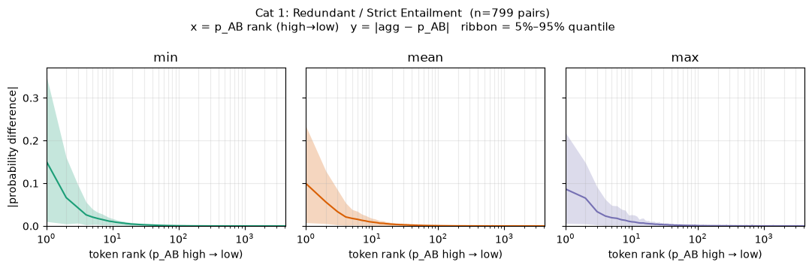
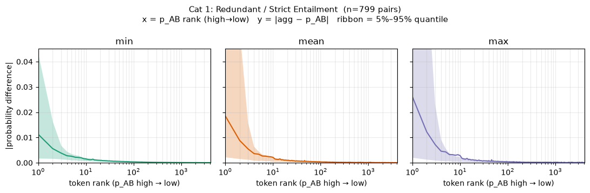
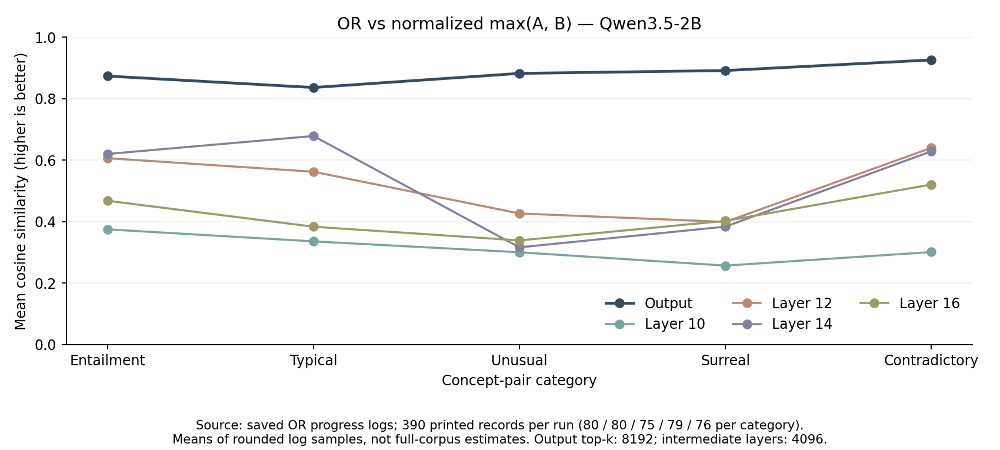
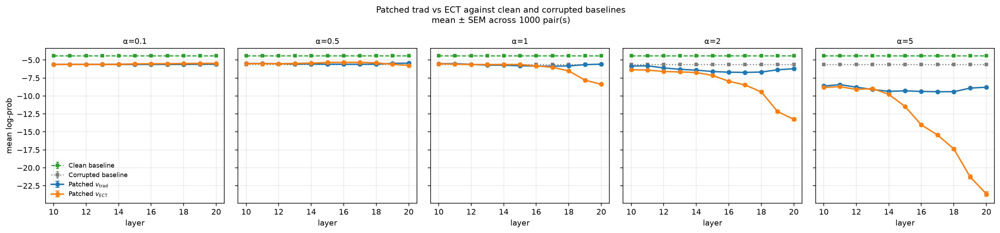
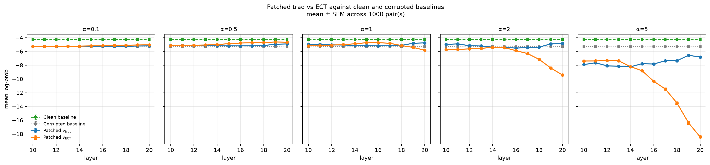
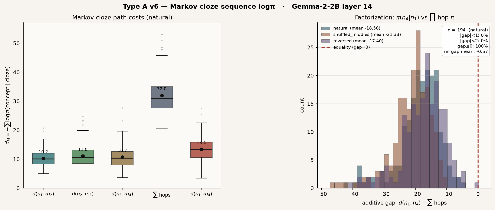
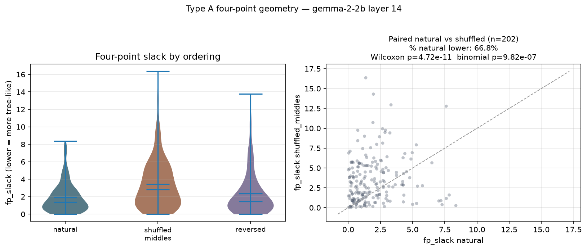
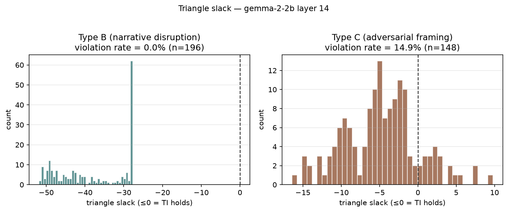

# Testing Bradley’s theory in language models

I am testing three ideas motivated by Bradley et al.’s *An Enriched Category Theory of Language*: logical composition, contextual entailment, and semantic geometry. These experiments use practical approximations of the mathematical objects in the paper.

## Aim 1 — Does AND behave like min, and OR like max?

I generated **3,885 concept pairs** across five categories: entailment, typical composition, unusual combinations, surreal combinations, and contradictions. For each pair, I compared the model’s representation of AND/OR with combinations of the two individual representations.

I started with **Qwen3.5-2B output probabilities and intermediate-layer logit-lens distributions**, then tested **Gemma-2-2B SAE features**. The SAE experiments also included template-baseline subtraction and feature-set intersection/union.

**Example pairs** (from the run logs, showing the core fields and the generated category labels):

```json
[
  {"category_id": 1, "word_a": "Transitive Verb", "word_b": "Verb"},
  {"category_id": 2, "word_a": "watering can", "word_b": "potted plants"},
  {"category_id": 3, "word_a": "honeycomb", "word_b": "sandboxing"},
  {"category_id": 4, "word_a": "Stoicism", "word_b": "Macarons"},
  {"category_id": 5, "word_a": "absolute certainty", "word_b": "radical uncertainty"}
]
```

*Categories: 1 = entailment; 2 = typical composition; 3 = unusual combination; 4 = surreal combination; 5 = contradiction. These are the corpus labels, not independently verified judgments.*

**Results so far:**

- For AND, the arithmetic mean had the highest category-average cosine similarity in **4/5 categories at the output layer** and **5/5 at layer 10**. Min won only the output-layer typical-composition category.
- In the sampled SAE logs, AND matched feature intersection better than union in only **136/390 printed examples (34.9%)**. This is a log sample, not the full dataset.
- For OR, the output distribution aligns with normalized max: category-average cosine similarities are **0.874, 0.837, 0.883, 0.892, and 0.926**, respectively. These are averages over **390 printed log records**, not the full dataset. Intermediate-layer agreement is lower and varies by layer and category.

**Current interpretation:** there is no consistent advantage for AND-as-min under these representations and prompts. OR shows encouraging agreement with max at the output layer, although the available OR logs do not establish whether max outperforms mean or min.



*Output layer, 799 entailment pairs. The plots show absolute differences between the predicted AND distribution and min/mean/max, ordered by token rank. Lower is better; ribbons show the 5th–95th percentiles.*



*The same comparison at layer 10. These plots show absolute probability differences; the category-level findings above use cosine similarity, so they measure different aspects of agreement.*



*OR results reconstructed from saved progress logs. Higher cosine means closer agreement with normalized max. Each curve summarizes 390 printed examples; this is not a comparison against alternative operators.*

## Aim 2 — Can an entailment-inspired direction improve predictions?

I compared two activation-patching directions in **Qwen3.5-2B**: a traditional hidden-state difference, and a Jacobian-based direction labelled “ECT” in the plots. Their magnitudes were matched before injection.

The experiments use **1,000 SNLI entailment pairs** and **1,000 ConceptNet IsA pairs**, testing layers **10–20** and intervention strengths **0.1, 0.5, 1, 2, and 5**. The outcome is hypothesis-token log-probability after patching a corrupted prompt; higher is better. The main comparison is **orange (Jacobian/ECT) versus blue (traditional-vector baseline)** at the same layer and strength. The clean and corrupted curves provide reference levels.

**Example sentence-entailment pair (SNLI-style).** This uses a bundled seed example to illustrate the format; it is not a verified row from the SNLI run.

```json
{
  "premise": "A man is playing a guitar on stage.",
  "hypothesis": "Someone is performing music.",
  "target_word": "music",
  "label": "entailment"
}
```

**Example ConceptNet IsA pair** (the format example from the project README):

```json
{
  "premise": "This is a dog.",
  "hypothesis": "This is an animal.",
  "target_word": "animal",
  "label": "entailment",
  "conceptnet_edge": "IsA"
}
```

*For both datasets, the neutral corrupted prompt is `It is the case that:`. The intervention is evaluated by scoring the hypothesis after patching this prompt.*



*SNLI: mean ± SEM across 1,000 pairs. Blue is the traditional direction; orange is the Jacobian direction. Green and grey show clean and corrupted baselines.*

**SNLI:** at **α = 0.5**, the Jacobian direction shows a small improvement over the blue traditional-vector baseline across several layers, although the advantage is not uniform. Stronger interventions reduce performance, particularly for the Jacobian direction in later layers.



*ConceptNet: the same comparison across 1,000 IsA pairs.*

**ConceptNet:** the positive result is clearer at **α = 0.5**, where the Jacobian direction exceeds the blue traditional-vector baseline across most layers, with a larger separation in the middle and later layers. There are also gains at some layers at **α = 1.0**. At larger strengths, its performance drops sharply, especially in later layers.

**Current interpretation:** this is a **partially positive result**: moderate Jacobian interventions can improve predictions over the traditional-vector baseline, especially on ConceptNet at **α = 0.5**. Recovering the clean baseline is not required for this relative improvement. The advantage depends on layer and strength, and statistical significance still needs checking from the full paired results. This supports the usefulness of the proposed direction in these settings; its correspondence to Bradley’s internal hom remains to be established.

## Aim 3 — Do semantic relationships show additive or tree-like geometry?

I generated **538 examples**: **194 hierarchical chains**, **196 narrative disruptions**, and **148 adversarially framed entailment examples**. I tested SAE/Jacobian representations and conditional-probability distances, including Gemma-2-2B and Gemma-2-9B runs.

**Type A — hierarchical chain** (core fields from the example printed in the run log):

```json
{
  "structure_type": "Type A: Strict Phylogenetic Chains",
  "node_1": "Living Organism",
  "node_2": "Plant",
  "node_3": "Flower",
  "node_4": "Rose"
}
```

**Type B — sudden narrative shift** (illustrative example based on the generation prompt):

```json
{
  "structure_type": "Type B: Sudden Contextual Shifts",
  "base_context": "The surgeon carefully picked up the scalpel.",
  "shift_context": "Then the surgeon suddenly started juggling glowing chainsaws.",
  "combined_sequence": "The surgeon carefully picked up the scalpel, and then suddenly started juggling glowing chainsaws."
}
```

**Type C — entailment inside an unusual frame** (illustrative example based on the generation prompt):

```json
{
  "structure_type": "Type C: Adversarial Functors (Contextual Distortions)",
  "entailed_concept": "poodle",
  "superordinate": "dog",
  "distorting_frame": "In a surreal dream sequence on Mars",
  "framed_sequence": "In a surreal dream sequence on Mars, a poodle is barking."
}
```

**Chain additivity.** I tested whether the direct distance from the first to the last concept equals the sum of the intermediate hops. The mean gap was **−18.56 for 2B** and **−20.16 for 9B**; no natural chain had an absolute gap below 2 in these runs. Exact additivity was not observed.



*The direct route is much shorter than the sum of the hops. Zero gap would indicate equality. This probe uses final-output probabilities despite the “layer 14” label in the original figure.*

**Four-point comparison.** I then compared natural, middle-swapped, and reversed hierarchical orderings. The latest 2B summary reports lower slack for natural than middle-swapped order in **66.8%** of rows, with mean slack **1.92 versus 3.43**. Natural does not show a consistent advantage over reversed order.



*These statistics are provisional: the summary contains 202 hierarchy rows rather than 194, suggesting eight repeated smoke-test rows. The score also uses directed conditionals, so the difference can reflect direction preference rather than tree geometry. The displayed p-values need recomputing after checking the records.*

**Narrative disruption and framing.** The 2B run reports positive slack in **0/196 narrative examples** and **22/148 framed examples (14.9%)**. The 9B framed rate is **31/148 (20.9%)**.



*The framing calculation uses mismatched directions for a directed triangle, so the positive-slack cases should not yet be interpreted as genuine triangle-inequality violations.*

**Current interpretation:** the experiments show sensitivity to hierarchical order and framing, but do not yet establish Bradley-style metric or tree structure. The immediate next steps are to remove duplicate records, correct the directed-triangle calculation, and repair the calibration check’s inconsistent scoring of newline separators.
